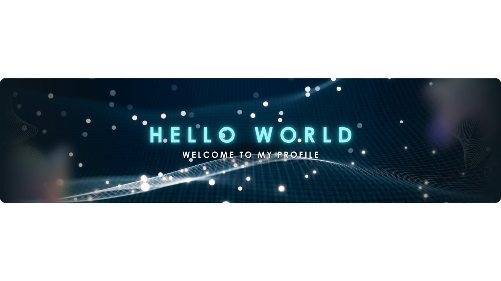

<!--Banner-->

<!--Night Owl image-->

<!--Header Name-->
#  ɪ'ᴍ Abdelhamid! 
*Digital Craftsman (Developer / Programmer)*
  

<!--Start Intro-->               

I am a Full Stack Developer with strong expertise in Next.js, React.js, Node.js, Express, and Python, along with experience in building APIs and backend systems.

- ✨ Student of life :)
- 🌱 I’m currently learning many things. I believe that every day is a learning opportunity.
- ❤ Contributing to Open Source.
- 💻 Visit my [Portfolio](https://lboss.vercel.app/) for more details about me.
- 🖤 Clean code is the art of making chaos look elegant

<!--End Intro-->

<!--Profile Count Badge-->

  

---

<!--Languages and Tools Section-->       
<h2 align="center">Tᴇᴄʜ sᴛᴀᴄᴋ & Lᴀᴛᴇsᴛ ʙʟᴏɢs</h2> 
<picture>
  <source media="(prefers-color-scheme: dark)" srcset="./Skills_Animation_Dark.gif">
  <source media="(prefers-color-scheme: light)" srcset="./Skills_Animation_White.gif">
  
</picture>
 

<h3 align="center">Building Strong Foundations</h3>
<ul align="left">
  
    - > HTML, CSS, JavaScript, Git & GitHub 🧩
  
    - > VS Code & Developer Tools 🛠️
    
    - > Python (Currently Learning) 🐍
    
    - > Computer Science Fundamentals 🧠
    
    - > Cyber Security Basics 🛡️
      
    - > Learning Journey & Tech Blogs 🚀

</ul>

 
 
 

 
 

<!-- GitHub Stats -->
<table width="100%" align="center" >

</table>
 

<!--Contribution Graph-->
<h2 align="center">📈 Cᴏɴᴛʀɪʙᴜᴛɪᴏɴ Gʀᴀᴘʜ 📈</h2>

    

<h2 align="center">🌟 Tʜᴏᴜɢʜᴛ ᴏғ ᴛʜᴇ Dᴀʏ 🌟</h2>

    

<!--Contact Section--> 
<h2 align="center">🤝 Cᴏɴɴᴇᴄᴛ Wɪᴛʜ Mᴇ 🤝 </h2>

  
  
  
  
  
  

 
 

<picture>
  <source media="(prefers-color-scheme: dark)" srcset="https://raw.githubusercontent.com/platane/platane/output/github-contribution-grid-snake-dark.svg">
  <source media="(prefers-color-scheme: light)" srcset="https://raw.githubusercontent.com/platane/platane/output/github-contribution-grid-snake.svg">
  
</picture>

<!--Footer--> 

  

